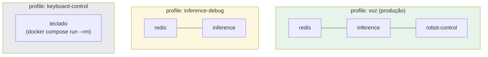

# Profiles do docker-compose

Cada profile ativa um subconjunto de serviços, dependendo do que está sendo testado.

Ver [fluxo_de_dados.md](./fluxo_de_dados.md) para o que cada serviço faz.

| Profile | Comando | Uso |
|---|---|---|
| `voz` | `docker compose --profile voz up` | Pipeline completo, produção |
| `inference-debug` | `docker compose --profile inference-debug up` | Testar wake word/Whisper/classificador sem o robô |
| `keyboard-control` | `docker compose run --rm teclado` | Testar o robô manualmente, sem voz |