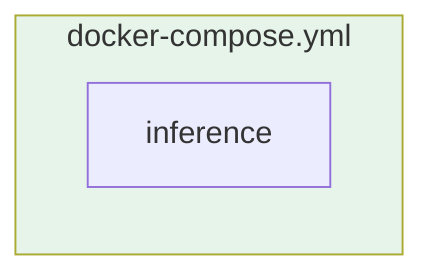

# Serviços do docker-compose

Ver [fluxo_de_dados.md](./fluxo_de_dados.md) para o que o serviço faz.

| Comando | Uso |
|---|---|
| `docker compose up` | Sobe a inferência (wake word/Whisper/classificador) |

O controle do robô (WebRTC) não faz mais parte deste repositório — é responsabilidade do `go2-api` (repo separado).
