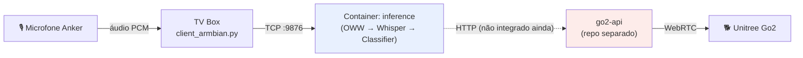

# Fluxo de Dados — Go2 Voice Control

Visão macro do caminho de um comando de voz, do microfone até o robô.

Para o que acontece dentro da caixa "inference", ver [inference_estados.md](./inference_estados.md).

Este repositório cobre só até o `inference`. O envio do comando ao robô (via HTTP para o `go2-api`) ainda não está integrado — ver `TODO` em `publish_command()` no `inference/src/server.py`. O `go2-api` é dono único da conexão WebRTC com o Go2.