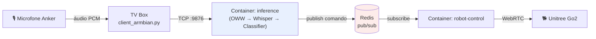

# Fluxo de Dados — Go2 Voice Control

Visão macro do caminho de um comando de voz, do microfone até o robô.

Para o que acontece dentro da caixa "inference", ver [inference_estados.md](./inference_estados.md).

