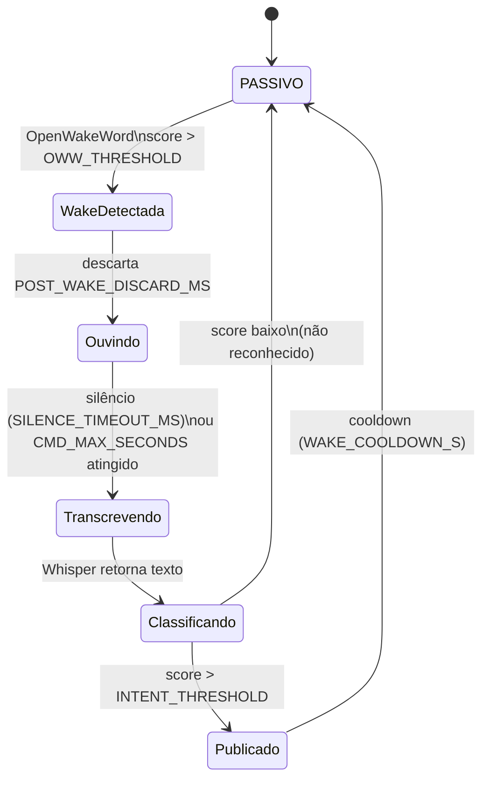

# Estados internos do `inference`

Máquina de estados executada dentro do container `inference` para cada sessão de comando.

Ver [fluxo_de_dados.md](./fluxo_de_dados.md) para onde essa caixa se encaixa no pipeline geral.

